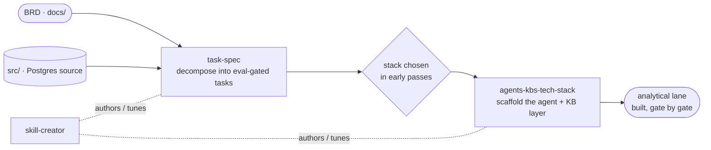

# `.claude/skills/` — the Converge engine

These are the **skills that build the analytical lane**, not part of the lane
itself. The rest of this repo is a deterministic Postgres source (see the root
[`readme.md`](../../readme.md)); the skills here are the reusable machinery
**Converge** uses to compile that source — plus the [BRD](../../docs/brd-analytical-backbone.pdf) —
into a working analytics platform, one gated pass at a time.

Think of it as the separation the repo is built around:

- **`src/`** = the *material* being built on (the operational Postgres source).
- **`docs/brd-analytical-backbone.pdf`** = the *input* (problem + outcomes, no tech).
- **`.claude/skills/`** = the *engine* (what turns the input into the lane).

Nothing here is specific to e-commerce or to this repo — they are portable. The
full Converge method lives at [`../../../converge`](../../../converge); this repo
vendors only the three skills needed to drive a build end-to-end from here.

## The three skills

| Skill | Version | Role in a Converge build |
|-------|---------|--------------------------|
| [`task-spec`](task-spec/) | 3.2.0 | Turn intent into atomic, self-verifying task specs (the **Fork B** / task-driven path) |
| [`agents-kbs-tech-stack`](agents-kbs-tech-stack/) | 0.3.0 | Scaffold the tech-stack agent + knowledge layer once the stack is chosen |
| [`skill-creator`](skill-creator/) | — | Author, edit, and benchmark skills themselves (the meta-tool) |

### `task-spec` — eval-driven task specification

The centerpiece. Generates **vendor-neutral, self-verifying Task-Spec v3** files:
each spec is a task PRD carrying **runnable bash evals**, a behavior-to-eval
traceability chain, and a post-execution acceptance gate — so "done" is
*machine-checkable*, not a matter of opinion, and any conformant agent (Claude,
Codex, Cursor, or manual execution) can walk it out.

- **What it produces:** a task spec where the eval *is* the definition of done —
  fuse of PRD + BDD + EDD (eval-driven development).
- **Size-aware routing:** XS/S/M work runs directly; **L** runs on GLM (one
  coherent goal); **XL** or subjective work routes to SDD.
- **When it triggers:** "create a task", "scaffold a task", "make this
  executable", "decompose this into work", "turn this into a backlog", or any
  mention of Task-Spec / EDD.
- **Why it matters here:** this is the *optionality moat* — because the eval
  defines done, you can swap the agent underneath without rewriting the work.

Substructure: `scripts/` (the runnable engine + `_lib.sh` version source),
`templates/`, `references/concepts/` (the EDD/Task-Spec design docs), `evals/`
+ `tests/` (its own test harnesses), `runbooks/dispatch-recipes/` (per-agent
adapters), `configs/`, `plugin.json` + `marketplace.json`. See
[`task-spec/CHANGELOG.md`](task-spec/CHANGELOG.md) for version history.

### `agents-kbs-tech-stack` — the tech-stack agent layer

Once Converge's early passes **choose** the stack (engine, table format,
transformation tool — decisions the base deliberately leaves open), this skill
scaffolds the agent + knowledge layer for it: for each picked technology it emits
a paired **architect + developer** agent plus a full KB tree, and installs three
universal closers (`code-reviewer`, `code-simplifier`, `code-documenter`) that
ground in every tech KB.

- **v0.3.0** adds a quality-gate pass (lints scaffolded output for drift), a
  cross-tool emission step (publishes `AGENTS.md` + Cursor rules + Copilot
  instructions alongside `.claude/`), and a tunable `doctrine.yaml` so Codex /
  Cursor / Copilot inherit the same agent contract.
- **When it triggers:** bootstrapping a new repo's technology coverage, or adding
  a new tech to an existing fleet.

Substructure: `menu/` (the curated tech menu), `templates/`, `prompts/`,
`references/`, `runbooks/`, `scripts/`.

### `skill-creator` — the meta-tool

Creates, edits, and measures skills — including the two above. It enforces the
Anthropic skill spec (frontmatter keys, description limits, word count) and can
**run evals** and **benchmark trigger accuracy with variance analysis**.

- **When it triggers:** create a skill from scratch, edit/optimize an existing
  skill, run evals to test a skill, or optimize a description for better
  triggering.
- **Key tooling:** `scripts/quick_validate.py` (spec conformance),
  `scripts/run_eval.py` + `eval-viewer/` (benchmark harness).

## How they compose in a build

`skill-creator` sits to the side — it maintains the other two rather than
running in the build path.

## Conventions

- **Portable, not repo-specific.** Every skill here works in any repo; none
  encodes e-commerce or this schema. They are vendored from the `converge`
  method repo, kept byte-identical.
- **Skill spec compliance.** Frontmatter carries only the allowed keys
  (`name`, `description`, optional `metadata`, …); versions live under
  `metadata.version`, never as a top-level `version:` key. Validated with
  `skill-creator/scripts/quick_validate.py`.
- **These are the engine, not the deliverable.** They are committed here so the
  build is reproducible from this repo alone — but nothing they *produce* (the
  analytical lane) is committed yet. That is the point of the base.
