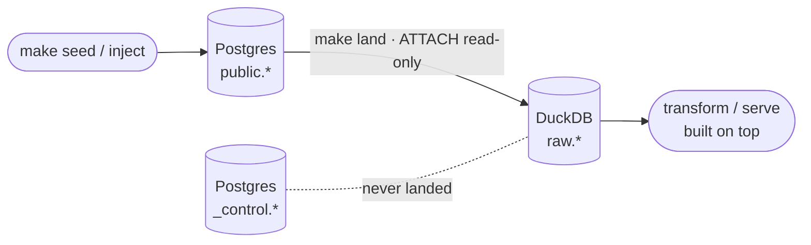
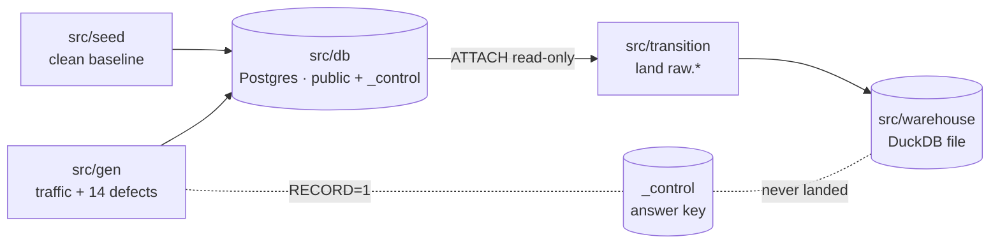
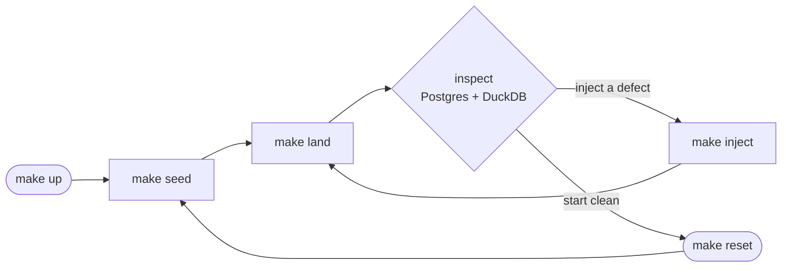

# Postgres → DuckDB Analytics Backbone

A working **brownfield base** for an AI-native DataOps workshop — the deterministic
foundation a full analytics platform gets built on top of, live, in front of an
audience.

The scenario is a familiar one. A high-volume e-commerce company runs both its
storefront and its analytics on a single Postgres database, and the two workloads
fight for the same resources: heavy analytical scans slow down order processing,
and the transactional write load makes reporting crawl. The fix is to lift
analytics off the operational database into a purpose-built store — which is
exactly the seam this repo establishes.

What's here today is a small, honest, end-to-end slice of that: a realistic
Postgres source, a deterministic generator that can both seed clean data and inject
real-world defects, and a one-step movement into DuckDB. It is intentionally a
*starting point* — a system that already runs, so the workshop can extend it from a
requirements document rather than from an empty directory. Everything is verified
to work end to end (`make seed` → Postgres → `make land` → DuckDB, with exact row
parity).

What ships here:

- a **Postgres** source schema (auto-applied on first boot),
- a **deterministic seeder** that produces a clean, correlated baseline,
- a **14-mode chaos generator** that injects generic data-quality, schema, and
  availability defects into the source — and can log ground truth to a fenced
  `_control.injected_incidents` ledger that lives **outside** the `public`
  business tables, and
- a **transition step** (`src/transition`) that pulls Postgres into a **DuckDB**
  warehouse via `ATTACH`, giving you `raw.*` tables to transform downstream.

Postgres is containerized; **DuckDB is not** — it is an embedded, in-process
library backed by a single local file. There is no DuckDB server or container.

## What the pipeline actually is

Three steps, one direction. The generator seeds (and corrupts) the operational
**Postgres** source; `make land` `ATTACH`es Postgres read-only from **DuckDB** and
copies the business tables into `raw.*`; everything downstream reads the warehouse.



The source `public` schema holds only the four business tables — it looks like a
real production database, with no incident table to give the game away. The
ground-truth ledger lives in a separate `_control` schema the warehouse never
reads (the dotted edge): a sealed answer key, written only with `RECORD=1`.

## Architecture

The source crosses into the analytical store exactly once, through `src/transition`.
`src/db` and `src/warehouse` are the two leaves everything else depends on.



| Package          | Role |
|------------------|------|
| `src/db`         | Postgres connection + schema (`01_schema.sql`) — the operational source |
| `src/seed`       | Deterministic clean baseline (correlated synthetic data) |
| `src/gen`        | 14-mode chaos generator + fenced `_control.injected_incidents` ledger |
| `src/transition` | Postgres -> DuckDB `raw.*` movement via `ATTACH` (full refresh) — the only bridge |
| `src/warehouse`  | The single embedded DuckDB file + the connection contract |

`make land` runs `src/transition`, which `ATTACH`es Postgres read-only from DuckDB
and copies the source tables into `raw.*` inside a single embedded DuckDB file
(`src/warehouse/warehouse.duckdb` by default; override with `DUCKDB_DATABASE`).
That warehouse file is the seam everything downstream reads from. See
[`src/README.md`](src/README.md) for the per-package deep dive — the schema, the
landing contract, the warehouse contract, and the 14 failure modes.

## Quickstart

```bash
make setup                       # uv sync — install deps
cp .env.example .env             # configure Postgres + warehouse env
make up                          # start Postgres (schema auto-applied)
make seed                        # deterministic clean baseline
make land                        # Postgres -> DuckDB raw.* via ATTACH

make inject FAILURE=schema_drift # inject a defect (SILENT by default)
make failures                    # list all 14 failure modes
```

The operator loop — set up once, then cycle seed → land → inspect → reset:



### Silent failures and the fenced answer key

Injection is **silent by default**: `make inject FAILURE=<key>` mutates the source
but writes **nothing** to the ledger — the defect lives only in the data,
undeclared, exactly as a real incident would arrive. You investigate it the way an
on-call engineer does: notice the numbers are off, then go digging. To record
ground truth (so a future detector can be *scored* against it, not just sound
plausible), opt in:

```bash
make inject FAILURE=schema_drift RECORD=1   # also writes _control.injected_incidents
```

Two things make this realistic:

- **The answer key is fenced.** It lives in a separate `_control` schema, never in
  `public`. The business tables the analytics read have no incident table — the
  source looks exactly like production. `_control` is also never copied into the
  DuckDB warehouse.
- **Silent by default is deliberate.** The ledger is the scoring oracle (the sealed
  envelope), opened only at the reveal. A detector that can already see the answer
  key proves nothing.

## Make targets

| Target         | What it does |
|----------------|--------------|
| `setup`        | Install Python dependencies with `uv` |
| `up`           | Start PostgreSQL; wait until healthy (schema auto-applied) |
| `down`         | Stop containers, keep data |
| `restart`      | `down` then `up` |
| `logs`         | Tail PostgreSQL logs |
| `ps`           | Show container status |
| `psql`         | Open a `psql` shell against the source database |
| `seed`         | Generate a clean correlated dataset (`CUSTOMERS/PRODUCTS/ORDERS/SEED`) |
| `reseed`       | Truncate then regenerate a fresh clean dataset |
| `reset`        | Destroy the data volume and recreate an empty database |
| `clean`        | Remove containers and the data volume |
| `failures`     | List the available failure modes |
| `traffic`      | Insert normal orders (`TRAFFIC=count`) |
| `inject`       | Inject one defect SILENTLY (`FAILURE=`); add `RECORD=1` to log the ledger |
| `reset-schema` | Revert schema drift (`user_id` -> `customer_id`) |
| `watch`        | Stream traffic and inject random failures (Ctrl-C to stop) |
| `land`         | Land Postgres into DuckDB via `ATTACH` (`raw.*`) |
| `test`         | Run the `pytest` suite |
| `lint`         | Lint with `ruff` |

Variables you can override on any `make` call: `CUSTOMERS`, `PRODUCTS`, `ORDERS`,
`SEED`, `FAILURE`, `TRAFFIC`, `RECORD`.

## Current state

This is a working brownfield base, not a skeleton. What runs today, verified end to
end:

- **A realistic Postgres source.** Four correlated business tables — `customers`,
  `products`, `orders`, `payments` — under `public`, plus a fenced
  `_control.injected_incidents` ledger. The schema is applied automatically when the
  container boots.
- **A deterministic seeder.** `make seed` produces a clean, internally consistent
  baseline (orders never predate the customer, payment amounts match order totals,
  `returned` orders are `refunded`) that is reproducible for a given `--seed`.
- **A 14-mode defect generator.** Generic data-quality, schema, and availability
  defects you can inject one at a time or stream continuously. Injection is silent by
  default — the defect lands in the data, undeclared — with the ground-truth answer
  key recorded to the fenced `_control` ledger only on `RECORD=1`.
- **A Postgres → DuckDB transition.** `make land` `ATTACH`es Postgres read-only from
  an embedded DuckDB file and copies the source into `raw.*`, preserving types and
  defects and stamping lineage columns. This is the one bridge between the
  operational and analytical halves, and it is strictly one-directional.

Everything above is exercised by the `make` targets and confirmed working with exact
row parity between Postgres and DuckDB (see the per-package
[`src/README.md`](src/README.md) for the contracts and a verified-run walkthrough).

This base is the launch point: from here, the platform is grown against a
requirements document — adding the transformation, serving, and detection layers on
top of a system that already runs — rather than from an empty repository.
