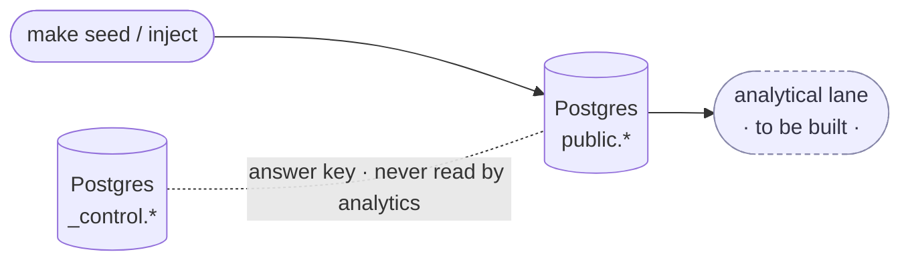
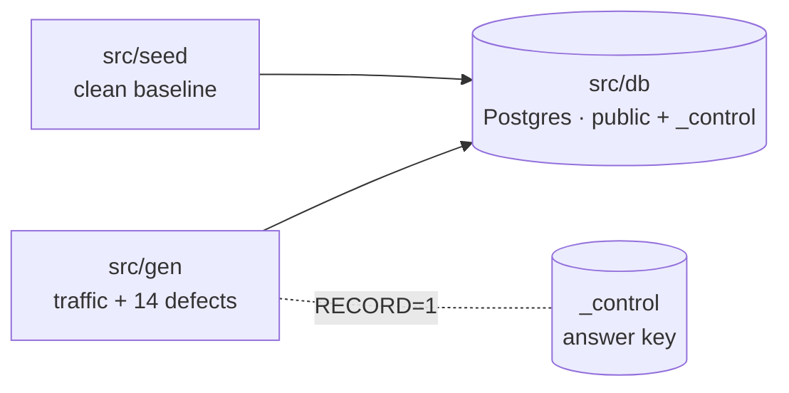
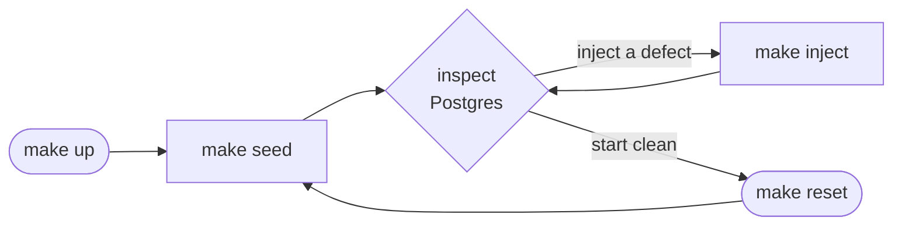
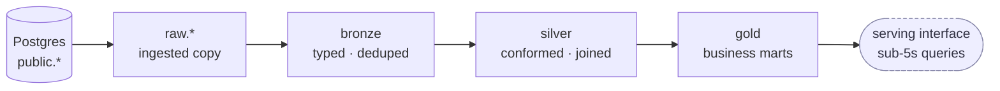

# Analytical Backbone — the brownfield base

A working **brownfield base** for building an analytical lane with **Converge** —
the deterministic operational source a full analytics platform gets built on top
of, live, from a requirements document.

The scenario is a familiar one (stated in full in the
[BRD](docs/brd-analytical-backbone.pdf)). A high-volume e-commerce company —
roughly **$500M GMV** across **50,000 orders/day** — runs both its storefront and
its analytics on a single Postgres database, and the two workloads fight for the
same resources: heavy analytical scans slow down order processing, and the
transactional write load makes reporting crawl. A core analytical query takes
**12 minutes where the business needs under 5 seconds** — a 144× gap that signals
the wrong engine for the job, not a slow query. The fix is to lift analytics off
the operational database into a purpose-built store. **That analytical lane does
not exist yet — it is exactly what Converge builds.**

What's here today is the *starting point*: a realistic Postgres source and a
deterministic generator that can both seed clean data and inject real-world
defects. It is intentionally a system that already runs, so the build can extend it
from a **Business Requirements Document** ([`docs/brd-analytical-backbone.pdf`](docs/brd-analytical-backbone.pdf))
rather than from an empty directory.

What ships here:

- a **Postgres** source schema (auto-applied on first boot),
- a **deterministic seeder** that produces a clean, correlated baseline, and
- a **14-mode chaos generator** that injects generic data-quality, schema, and
  availability defects into the source — and can log ground truth to a fenced
  `_control.injected_incidents` ledger that lives **outside** the `public`
  business tables.

## What the base actually is

The generator seeds (and corrupts) the operational **Postgres** source. That's the
whole base — one source, deterministic and reproducible. Everything analytical is
built on top of it.


```mermaid
graph LR
    G([make seed / inject]) --> P[(Postgres<br/>public.*)]
    C[(Postgres<br/>_control.*)] -.answer key · never read by analytics.- P
    P --> LANE([analytical lane<br/>· to be built ·]):::todo
    classDef todo fill:#eef,stroke:#88a,color:#334,stroke-dasharray:4 3;
```

The source `public` schema holds only the four business tables — it looks like a
real production database, with no incident table to give the game away. The
ground-truth ledger lives in a separate `_control` schema (a sealed answer key,
written only with `RECORD=1`).

## Architecture

Three packages, one operational source. `src/db` is the leaf everything depends on.


```mermaid
graph LR
    SEED[src/seed<br/>clean baseline] --> DB
    GEN[src/gen<br/>traffic + 14 defects] --> DB
    DB[(src/db<br/>Postgres · public + _control)]
    GEN -.RECORD=1.- LEDGER[(_control<br/>answer key)]
```

| Package    | Role |
|------------|------|
| `src/db`   | Postgres connection + schema (`01_schema.sql`) — the operational source |
| `src/seed` | Deterministic clean baseline (correlated synthetic data) |
| `src/gen`  | 14-mode chaos generator + fenced `_control.injected_incidents` ledger |

See [`src/README.md`](src/README.md) for the per-package deep dive — the schema and
the 14 failure modes.

## Repository layout

What's in the repo today, top to bottom:

```text
.
├── src/                 the operational base (the only runnable code here)
│   ├── db/              Postgres connection + 01_schema.sql (the source of truth)
│   ├── seed/            deterministic clean-baseline seeder
│   └── gen/             14-mode chaos generator + fenced _control ledger
├── docs/
│   └── brd-analytical-backbone.pdf   the brief Converge compiles — problem + outcomes, no tech
├── .claude/
│   ├── skills/          the Converge engine (task-spec, agents-kbs-tech-stack, skill-creator) — see its README
│   └── settings.json    project permissions (allow the operator loop, deny data-destroying targets)
├── docker-compose.yml   Postgres 17 service (schema auto-applied on first boot)
├── Makefile             the operator surface (setup / up / seed / inject / …)
├── pyproject.toml       uv-managed deps (faker + psycopg), ruff + pytest config
├── uv.lock              pinned dependency lockfile
└── .env.example         Postgres connection template (copy to .env)
```

Two things worth calling out: `docs/` holds the **input** to the build (the BRD, technology-free
on purpose), and `.claude/skills/` holds the **engine** that does the build. Everything the analytics
platform becomes lands *on top of* `src/` — none of it is committed here yet.

## Quickstart

```bash
make setup                       # uv sync — install deps
cp .env.example .env             # configure Postgres env
make up                          # start Postgres (schema auto-applied)
make seed                        # deterministic clean baseline

make inject FAILURE=schema_drift # inject a defect (SILENT by default)
make failures                    # list all 14 failure modes
```

The operator loop — set up once, then cycle seed → inspect → reset:


```mermaid
graph LR
    A([make up]) --> B[make seed]
    B --> E{inspect<br/>Postgres}
    E -->|inject a defect| D[make inject]
    D --> E
    E -->|start clean| F([make reset])
    F --> B
```

### Silent failures and the fenced answer key

Injection is **silent by default**: `make inject FAILURE=<key>` mutates the source
but writes **nothing** to the ledger — the defect lives only in the data,
undeclared, exactly as a real incident would arrive. You investigate it the way an
on-call engineer does: notice the numbers are off, then go digging. To record
ground truth (so a future detector can be *scored* against it, not just sound
plausible), opt in:

```bash
make inject FAILURE=schema_drift RECORD=1   # also writes _control.injected_incidents
```

Two things make this realistic:

- **The answer key is fenced.** It lives in a separate `_control` schema, never in
  `public`. The business tables have no incident table — the source looks exactly
  like production.
- **Silent by default is deliberate.** The ledger is the scoring oracle (the sealed
  envelope), opened only at the reveal. A detector that can already see the answer
  key proves nothing.

## Make targets

| Target         | What it does |
|----------------|--------------|
| `setup`        | Install Python dependencies with `uv` |
| `up`           | Start PostgreSQL; wait until healthy (schema auto-applied) |
| `down`         | Stop containers, keep data |
| `restart`      | `down` then `up` |
| `logs`         | Tail PostgreSQL logs |
| `ps`           | Show container status |
| `psql`         | Open a `psql` shell against the source database |
| `seed`         | Generate a clean correlated dataset (`CUSTOMERS/PRODUCTS/ORDERS/SEED`) |
| `reseed`       | Truncate then regenerate a fresh clean dataset |
| `reset`        | Destroy the data volume and recreate an empty database |
| `clean`        | Remove containers and the data volume |
| `failures`     | List the available failure modes |
| `traffic`      | Insert normal orders (`TRAFFIC=count`) |
| `inject`       | Inject one defect SILENTLY (`FAILURE=`); add `RECORD=1` to log the ledger |
| `reset-schema` | Revert schema drift (`user_id` -> `customer_id`) |
| `watch`        | Stream traffic and inject random failures (Ctrl-C to stop) |
| `test`         | Run the `pytest` suite |
| `lint`         | Lint with `ruff` |

Variables you can override on any `make` call: `CUSTOMERS`, `PRODUCTS`, `ORDERS`,
`SEED`, `FAILURE`, `TRAFFIC`, `RECORD`.

## The build target: an analytical lane, via Converge

This base exists to be built *on*. The Business Requirements Document
([`docs/brd-analytical-backbone.pdf`](docs/brd-analytical-backbone.pdf)) states the
problem and the required outcomes — *no technology, no architecture* — and
**Converge** compiles that brief into the analytical lane: a tech-spec, then plans,
then eval-backed tasks, then a fitted harness, then merged code, each pass ending
at a gate.

Concretely, the target is a **medallion pipeline off the Postgres source**, ending
in a queryable serving interface:


```mermaid
graph LR
    P[(Postgres<br/>public.*)] --> RAW[raw.*<br/>ingested copy]
    RAW --> BRONZE[bronze<br/>typed · deduped]
    BRONZE --> SILVER[silver<br/>conformed · joined]
    SILVER --> GOLD[gold<br/>business marts]
    GOLD --> SERVE([serving interface<br/>sub-5s queries]):::todo
    classDef todo fill:#eef,stroke:#88a,color:#334,stroke-dasharray:4 3;
```

That closes the gap the BRD names: the 12-minute analytical query becomes a
sub-5-second one, because it runs against `gold` marts on an analytical engine
instead of scanning the operational tables. **Which** engine, table format, and
transformation tool fill each box is *not decided here* — Converge picks them in
its early passes (grounding the tech-spec against this repo, then writing ADRs).
The lane is the deliverable Converge produces; nothing above `raw.*` is shipped in
this repo yet.

The Converge engine is available in this repo under `.claude/skills/`
(`task-spec`, `agents-kbs-tech-stack`, `skill-creator`); the full method lives at
[`../converge`](../converge).

## Current state

A working brownfield base, not a skeleton — but deliberately *just the source*:

- **A realistic Postgres source.** Four correlated business tables — `customers`,
  `products`, `orders`, `payments` — under `public`, plus a fenced
  `_control.injected_incidents` ledger. The schema is applied automatically when the
  container boots.
- **A deterministic seeder.** `make seed` produces a clean, internally consistent
  baseline (orders never predate the customer, payment amounts match order totals,
  `returned` orders are `refunded`) that is reproducible for a given `--seed`.
- **A 14-mode defect generator.** Generic data-quality, schema, and availability
  defects you can inject one at a time or stream continuously. Injection is silent by
  default — the defect lands in the data, undeclared — with the ground-truth answer
  key recorded to the fenced `_control` ledger only on `RECORD=1`.

From here, the analytical lane is grown against the requirements document — rather
than from an empty repository.
