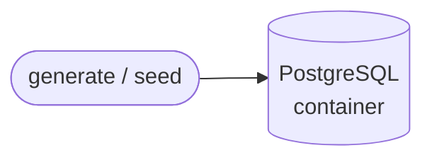

# src/ — the operational source (initial state)

`src/` is the deterministic foundation everything else gets built on: a synthetic
generator feeds **PostgreSQL**, and that Postgres database is the operational
source. That is all that exists today. The analytical lane — landing the source
into DuckDB, modelling it with dbt, and serving it over MCP — is **not built
yet**. It is precisely what gets built *on top of* this base.

Only Postgres is containerized here; there is no analytical store, no warehouse
file, and no transform step in the repo at this stage.



> **Verified.** On a clean slate, `make up` boots Postgres and auto-applies
> `01_schema.sql`; `make seed` loads a deterministic, correlated baseline
> (customers=500, products=200, orders=5000, payments=5000). The `_control`
> ledger stays empty and fenced — the `public.*` business tables are the whole
> of what a consumer would ever read.

---

## The three packages

| Package    | Role                                                    | Key entry points |
|------------|---------------------------------------------------------|------------------|
| `src/db`   | Postgres source contract + write helpers; owns the DDL. | `conninfo()`, `connect()`, `insert_returning_ids()`, `count()`, `truncate_all()`, `db/01_schema.sql` |
| `src/seed` | Deterministic clean baseline (correlated synthetic data). | `python -m src.seed.seed`, `seed.run()`, `EcommerceFactory` |
| `src/gen`  | Chaos generator: normal traffic + 14 defect injectors.  | `python -m src.gen.cli`, `engine.run_traffic/inject/watch`, `failures.REGISTRY` |

`db` is the leaf every other package routes through; `seed` and `gen` are the two
writers that put rows into Postgres.

### `src/db`

The Postgres source contract and the write helpers everything else routes through.
`db/01_schema.sql` is the DDL (mounted into the container and auto-applied on first
boot). Public entry points: `conninfo()`, `connect()`, `insert_returning_ids()`,
`count()`, `truncate_all()`.

**Edges.** A leaf — it depends on nothing else in `src/`. It is imported by `seed`
and by `gen/repository`.

### `src/seed`

The deterministic clean baseline. The CLI builds correlated rows and loads them in
a single committed transaction:

```bash
python -m src.seed.seed --customers 500 --products 200 --orders 5000 --seed 42 --truncate
```

Public entry points: the CLI, `seed.run()`, and `EcommerceFactory` with
`.customer()` / `.product()` / `.order()` / `.payment()` plus its frozen value
objects. The data is **correlated, not random**: orders never predate the
customer's signup; product cost is 45–80% of `unit_price`; a returned order yields
a refunded payment; the payment amount mirrors the order total. Vocabulary is fixed
(8 `CATEGORIES`, plus `SEGMENTS`, `ORDER_STATUSES`, `PAYMENT_METHODS`,
`PAYMENT_STATUSES`).

**Edges.** Imports `src.db.connection`. Its `EcommerceFactory` is reused by
`gen/engine` so generated traffic is shaped like the seed.

### `src/gen`

The chaos generator — normal traffic plus 14 defect injectors. It knows *what* it
corrupts and nothing about *who* consumes it.

```bash
python -m src.gen.cli list                 # show the 14 failure modes
python -m src.gen.cli traffic --orders 200 # insert normal orders
python -m src.gen.cli inject <failure>     # inject one defect (silent)
python -m src.gen.cli reset-schema         # revert schema drift
python -m src.gen.cli watch                # stream traffic + random failures
```

Public surface: the CLI, `engine.run_traffic` / `inject` / `watch`,
`TrafficGenerator`, `failures.REGISTRY` / `get` / `InjectionResult` / `Failure`,
and the `repository.*` helpers.

**Edges.** `gen/repository` imports `src.db.connection`; `gen/engine` imports
`src.seed.factories`. See [The generator & failures](#the-generator--failures).

### Dependency graph

```
src.seed.seed ──→ src.db.connection
src.seed.factories  (no internal deps)

src.gen.cli ──→ src.gen.engine ──→ src.gen.repository ──→ src.db.connection
                        └────────→ src.seed.factories
src.gen.failures ──→ src.gen.repository
```

`db` is the single leaf; `seed` and `gen` are the only writers, and both reach
Postgres exclusively through `db.connection`.

---

## End-to-end data flow

```bash
make up                                  # Postgres boots; 01_schema.sql auto-applied
make seed                                # deterministic clean baseline
make inject FAILURE=<key> [RECORD=1]     # optional: corrupt the source (silent unless RECORD=1)
```

The trace:

1. **`make up`** — Postgres boots and auto-applies `01_schema.sql`, creating
   `public.{customers,products,orders,payments}` and an empty
   `_control.injected_incidents`.
2. **`make seed`** — `EcommerceFactory` builds correlated rows; `insert_returning_ids`
   loads customers → products → orders → payments in one committed transaction.
   Writes **only** `public.*`.
3. **(optional) `make traffic` / `inject` / `watch`** — mutate the source. The
   ledger is written **only** when `RECORD=1`.

### Tables present at each hop

| Hop                              | Store    | Schemas / tables |
|----------------------------------|----------|------------------|
| after `make up`                  | Postgres | `public.customers/products/orders/payments`; `_control.injected_incidents` (empty) |
| after `make seed`                | Postgres | `public.*` populated; `_control` empty |
| after `make inject ... RECORD=1` | Postgres | `public.*` corrupted; one row in `_control.injected_incidents` |

---

## The Postgres schema

`db/01_schema.sql` defines four business tables in `public`. All use a
`BIGINT IDENTITY` primary key, money as `NUMERIC` with a non-negative `CHECK`, and
timestamps as `TIMESTAMPTZ`.

**`customers`**

| Column        | Type / constraint |
|---------------|-------------------|
| `customer_id` | `BIGINT` PK |
| `full_name`   | text |
| `email`       | text, `UNIQUE` |
| `country`     | text |
| `city`        | text |
| `segment`     | text |
| `created_at`  | `TIMESTAMPTZ` DEFAULT `now()` |

**`products`**

| Column       | Type / constraint |
|--------------|-------------------|
| `product_id` | `BIGINT` PK |
| `sku`        | text, `UNIQUE` |
| `name`       | text |
| `category`   | text |
| `unit_price` | `NUMERIC(10,2)` ≥ 0 |
| `cost`       | `NUMERIC(10,2)` ≥ 0 |
| `created_at` | `TIMESTAMPTZ` DEFAULT `now()` |

**`orders`**

| Column         | Type / constraint |
|----------------|-------------------|
| `order_id`     | `BIGINT` PK |
| `customer_id`  | `BIGINT` FK → `customers` |
| `product_id`   | `BIGINT` FK → `products` |
| `quantity`     | `INT` > 0 |
| `unit_price`   | `NUMERIC(10,2)` ≥ 0 |
| `total_amount` | `NUMERIC(12,2)` ≥ 0 |
| `status`       | text |
| `ordered_at`   | `TIMESTAMPTZ` |

**`payments`**

| Column       | Type / constraint |
|--------------|-------------------|
| `payment_id` | `BIGINT` PK |
| `order_id`   | `BIGINT` FK → `orders` |
| `method`     | text |
| `amount`     | `NUMERIC(12,2)` ≥ 0 |
| `status`     | text |
| `paid_at`    | `TIMESTAMPTZ` |

Indexes: `idx_orders_customer_id`, `idx_orders_product_id`, `idx_orders_ordered_at`,
`idx_payments_order_id`.

**The `_control` fence.** A separate schema holds the answer key:
`_control.injected_incidents(incident_id PK, failure_key, detail, injected_at DEFAULT now())`
plus indexes. The DDL comment states the intent plainly: the ledger is a
facilitator-only artifact, written **only** with `--record` / `RECORD=1` and read
only at the reveal. The source database a consumer reads looks exactly like real
production — there is no incident table in `public` to give the game away.

---

## The generator & failures

`src/gen` injects 14 generic defects into the source. Each injector knows what it
corrupts and nothing about who consumes it.

| Key                     | Summary                                                      | Touches |
|-------------------------|--------------------------------------------------------------|---------|
| `negative_price`        | order with negative `unit_price` + `total`                   | orders |
| `missing_customer`      | order with NULL customer column                              | orders |
| `invalid_quantity`      | order with `quantity = -5`                                   | orders |
| `duplicate_order`       | re-insert the latest order verbatim                          | orders |
| `late_arrival`          | order backdated 45 days                                      | orders |
| `volume_spike`          | burst of 500 orders at one timestamp                         | orders |
| `schema_drift`          | rename `orders.customer_id` → `user_id` (idempotent)         | orders schema |
| `orphan_payment`        | drop FK, payment for `order_id = 999999999`                  | payments |
| `recurring_incident`    | re-inject negative price, reports occurrence number          | orders + reads ledger |
| `ambiguous_anomaly`     | 200 orders cancelled + 20 products price-cut 50%             | orders + products |
| `destructive_fix`       | zero `total_amount` on 300 recent orders                     | orders |
| `malformed_data`        | garbage string into `status` on 25 orders                    | orders |
| `slow_source`           | `pg_sleep(8)` holding a lock, `lock_timeout = 1s`            | orders availability |
| `multi_failure_cascade` | fires `missing_customer` + `volume_spike` + `schema_drift`   | orders schema + rows |

**Guards.** Several injectors call `_disable_order_checks()` first — it drops
`orders_unit_price_check` / `quantity_check` / `total_amount_check` plus the customer
`NOT NULL`, all `IF EXISTS` and idempotent. The customer column is resolved
dynamically so injectors tolerate prior drift.

**Silent by default.** `Failure.inject()` returns `InjectionResult(failure, detail)`
and writes nothing. `repo.record_incident()` is the only writer to
`_control.injected_incidents`, called only when `record=True` (CLI `--record`,
Makefile `RECORD=1` → `--record`). `engine.inject` special-cases the cascade
(threading `record` in; the cascade owns its own writes — no double write).
`count_incidents` returns `0` when silent.

**CLI surface.**

| Command                | What it does |
|------------------------|--------------|
| `list`                 | List the available failure modes |
| `traffic --orders N`   | Insert N normal orders (default 200) |
| `inject <failure> [--record]` | Inject one defect; `--record` writes the ledger |
| `reset-schema`         | Revert schema drift (`user_id` → `customer_id`) — the only built-in drift restore |
| `watch [...]`          | Stream traffic + random failures (`--interval 3.0 --batch 50 --failure-every 5 --failures... --record`) |

---

## Conventions

- **Determinism is selective.** The seed baseline is reproducible via `Faker.seed` —
  the same seed gives the same clean dataset. Generator traffic is **intentionally
  not** seeded; it is nondeterministic, like real production traffic.
- **Money and time are exact.** Money is `Decimal` cents; timestamps are tz-aware
  UTC. The factory quantises every monetary value to two places and never predates
  an order before its customer's signup.
- **No hardcoded secrets; parameterized SQL only.** Postgres credentials come from
  `POSTGRES_*` env with local-development defaults. All SQL parameters use
  placeholders; identifiers are interpolated only from internal constants or
  `information_schema`, never from user input.
- **The source looks like production.** `public.*` is all a consumer reads; the
  `_control` ledger is fenced off and written only on demand, so the operational
  source carries no answer key.

---

## Next: the analytical lane

This base is the operational source and nothing more. The analytical lane —
**DuckDB** (land the Postgres source), **dbt** (model bronze → silver → gold), and
**MCP** (serve the modelled data) — is the layer to be **built on top of** it, per
the BRD at [`docs/brd-analytical-backbone.pdf`](../docs/brd-analytical-backbone.pdf).
Nothing in that lane exists in the repo yet; this README describes only what is
present today.
